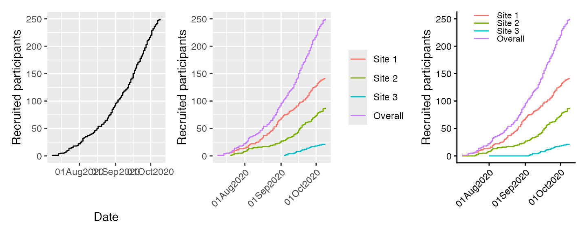
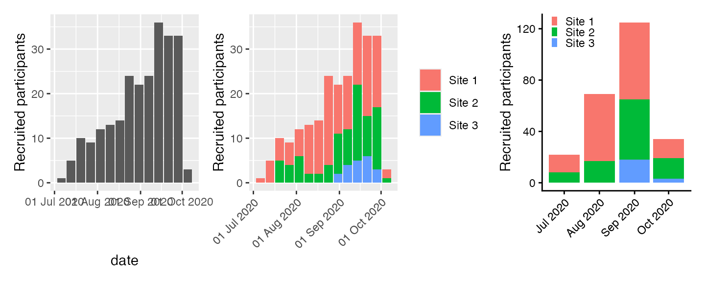
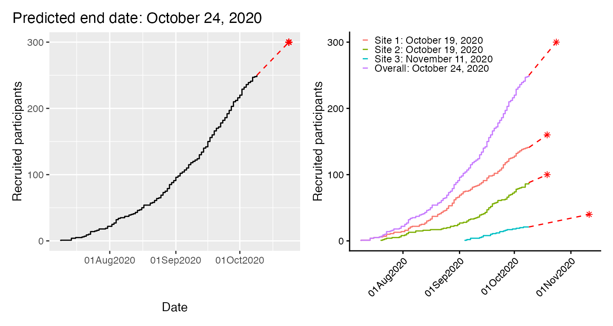

# accrualPlot

Following a trials recruitment is an important task for timing of
analyses and ensuring that a trial will not run for too long (longer
trials are more expensive). `accrualPlot` provides tools for easily
creating recruitment plots and even for predicting when a trial will
have successfully recruited all participants.

The package is loaded like any other:

``` r
library(accrualPlot)
#> Loading required package: lubridate
#> 
#> Attaching package: 'lubridate'
#> The following objects are masked from 'package:base':
#> 
#>     date, intersect, setdiff, union
```

## The `accrual_df`

To work with `accrualPlot`, we need some data, specifically dates and,
optionally, site identifiers. Here’s some data that we will use in the
following examples.

``` r
data(accrualdemo)
head(accrualdemo)
#>           date   site
#> 24  2020-07-09 Site 1
#> 87  2020-07-14 Site 1
#> 126 2020-07-14 Site 1
#> 193 2020-07-14 Site 1
#> 139 2020-07-16 Site 1
#> 248 2020-07-19 Site 1
```

`accrual_df`s are simply dataframes with the number of participants on
each day participants are recruited (or site) began recruiting.

### Monocentric trials

Monocentric trials obviously have only a single site, so we only need
the `x` object we just created. We can pass this into the
`accrual_create_df` function.

``` r
df <- accrual_create_df(accrualdemo$date)
print(df, head = TRUE)
#> 250 participants recruited between 2020-07-09 and 2020-10-09 
#>         Date Freq Cumulative
#> 1 2020-07-09    0          0
#> 2 2020-07-09    1          1
#> 3 2020-07-14    3          4
#> 4 2020-07-16    1          5
#> 5 2020-07-19    1          6
#> 6 2020-07-20    1          7
```

In this case, the `accrual_df` has a single data frame.

### Multicentric trials

For multicentric trials, we should also pass the site identifier to
`accrual_create_df` in the `by` argument.

``` r
df2 <- accrual_create_df(accrualdemo$date, by = accrualdemo$site)
print(df2, head = TRUE)
#> Site 1:
#> 141 participants recruited between 2020-07-09 and 2020-10-09 
#>         Date Freq Cumulative
#> 1 2020-07-09    0          0
#> 2 2020-07-09    1          1
#> 3 2020-07-14    3          4
#> 4 2020-07-16    1          5
#> 5 2020-07-19    1          6
#> 6 2020-07-21    1          7
#> 
#> Site 2:
#> 88 participants recruited between 2020-07-20 and 2020-10-09 
#>         Date Freq Cumulative
#> 1 2020-07-20    0          0
#> 2 2020-07-20    1          1
#> 3 2020-07-21    1          2
#> 4 2020-07-22    1          3
#> 5 2020-07-23    1          4
#> 6 2020-07-26    1          5
#> 
#> Site 3:
#> 21 participants recruited between 2020-09-04 and 2020-10-09 
#>         Date Freq Cumulative
#> 1 2020-09-04    0          0
#> 2 2020-09-04    1          1
#> 3 2020-09-05    1          2
#> 4 2020-09-07    2          4
#> 5 2020-09-12    1          5
#> 6 2020-09-13    1          6
#> 
#> Overall:
#> 250 participants recruited between 2020-07-09 and 2020-10-09 
#>         Date Freq Cumulative
#> 1 2020-07-09    0          0
#> 2 2020-07-09    1          1
#> 3 2020-07-14    3          4
#> 4 2020-07-16    1          5
#> 5 2020-07-19    1          6
#> 6 2020-07-20    1          7
```

In this case, the `accrual_df` is a list of dataframes, one for each
site and an overall.

### Start and end dates

By default, the start and end dates are defined based on the dates that
you pass to `accrual_create_df`. You can override these via the
`start_date` and `current_date` arguments. This is useful for when you
have particularly slow recruiting trials (such as those with
particularly strict inclusion criteria). For example, our fictitious
example trial might have started recruiting on the 1st November. By
adding this information, we modify other output

``` r
df3 <- accrual_create_df(accrualdemo$date, start_date = as.Date("2020-07-08"))
```

For multicentric trials where different sites started recruiting at
different times, we can pass a vector to `start_date`

``` r
start_date<-as.Date(c("2020-07-09","2020-07-09","2020-08-01"))
names(start_date)<-c("Site 1","Site 2","Site 3")
df4 <- accrual_create_df(accrualdemo$date, by = accrualdemo$site, start_date = start_date)
```

## Accrual plots

`accrualPlot` has three flavours of plots:  
\* Cumulative  
\* Absolute  
\* Prediction

and supplies both base graphics as well as `ggplot2` graphics
implementations (allowing easier modification).

### Cumulative plots

Cumulative plots show a standard step function of the number of
participants recruited up to a given point in time. The plots are
produced via the `plot` method (which is a wrapper for the internal
function `accrual_plot_cum`)

``` r
par(mfrow = c(1, 3))
plot(df)
plot(df2)
plot(df4)
```


For `ggplot2` graphics, use the engine option:

``` r
library(patchwork)
library(ggplot2)
p1 <- plot(df, engine = "ggplot")
p2 <- plot(df2, engine = "ggplot") + 
   theme(axis.text.x = element_text(angle = 45, vjust = 1, hjust=1),
         axis.title.x = element_blank())
p3 <- plot(df4, engine = "ggplot") +
  labs(col = "Site") +
  theme_classic() +
  theme(legend.position = c(.35,.9),
     legend.key.height = unit(2, "mm"),
         legend.text=element_text(size=8),
         legend.title=element_blank(),
     axis.text.x = element_text(angle = 45, vjust = 1, hjust=1),
         axis.title.x = element_blank())
p1 + p2 + p3
```



### Absolute recruitment

Recruitment plots per unit time can be obtained via the `absolute`
method (specify `which = "absolute"` to `plot`)

``` r
par(mfrow = c(1, 3))
plot(df, which = "abs", unit = "week")
plot(df2, which = "abs", unit = "week", legend.list=list(x="topleft"), xlabsel=seq(1,20,by=2))
plot(df4, which = "abs", unit = "month",legend.list=list(x="topleft"))
```


Options for `unit` are `year`, `month`, `week` and `day`.

Where multiple sites exist, the different sites are indicated by
different colours on the stacked bars.

``` r
p1 <- plot(df, which = "abs", unit = "week", engine = "ggplot")
p2 <- plot(df2, which = "abs", unit = "week", engine = "ggplot") + 
    theme(axis.text.x = element_text(angle = 45, vjust = 1, hjust=1),
         axis.title.x = element_blank())
p3 <- plot(df4, which = "abs", unit = "month", engine = "ggplot") +
  labs(fill = "Site") +
  theme_classic() +
  theme(legend.position = c(0.01,0.9),
     legend.justification = "left",
     legend.key.height = unit(2, "mm"),
     legend.key.width = unit(2, "mm"),
         legend.title=element_blank(),
     axis.text.x = element_text(angle = 45, vjust = 1, hjust = 1),
         axis.title.x = element_blank())
p1 + p2 + p3
```



It might be desirable to have panels for each site. This is easy to do
with the `ggplot` implementation. The variable to use in this case is
`site`, which is constructed in the appropriate plot function.

``` r
plot(df2, which = "abs", unit = "week", engine = "ggplot") + facet_wrap(~site)
```


### Predictions

### Date at which a target sample size is reached

In order predict the time point at which a certain number of
participants has been recruited (for estimating when a study will be
complete). If we want to recruit a total of 300 participants, we can put
that in the `target` option.

``` r
par(mfrow = c(1, 3))
plot(df, which = "predict", target = 300, cex_prediction=0.9)
plot(df2, which = "predict", target = 300, cex_prediction=0.9)
plot(df4, which = "predict", target = 300, cex_prediction=0.9,  center_legend="strip")
```


We can also include site-specific targets:

``` r
plot(df4, which = "predict", target=c("Site 1"=160,"Site 2"=100,"Site 3"=40,"Overall"=300),
     show_center=FALSE)
```


Or with `ggplot2`.

``` r
p1 <- plot(df, which = "predict", target = 300, engine = "ggplot2") +
  theme(plot.title.position = "plot")
p2 <- plot(df2, which = "predict", target=c("Site 1"=160,"Site 2"=100,"Site 3"=40,"Overall"=300),
  engine = "ggplot2") +
  labs(col = NULL) +
  theme_classic() +
  theme(legend.position = c(.025,.9),
        legend.justification = "left",
        legend.key.height = unit(2, "mm"),
        legend.key.width = unit(2, "mm"),
        legend.background = element_rect(fill = NA),
        axis.text.x = element_text(angle = 45, vjust = 1, hjust = 1),
        axis.title.x = element_blank())
p1 + p2
#> Warning in geom_point(aes(x = edate, y = targetm), col = col.pred, pch = pch.pred): All aesthetics have length 1, but the data has 79 rows.
#> ℹ Please consider using `annotate()` or provide this layer with data containing
#>   a single row.
```



In the second `ggplot2` example above, we specify different targets for
each site, plus a study-level target. The syntax is the same for base
graphics.

It’s not strictly necessary to use `plot` for any of the above figures.
`plot` is a wrapper which selects one of 6 underlying functions
depending on the value of the `which` and `engine` arguments. The
underlying functions for base graphics are `accrual_plot_cum` for
cumulative plots, `accrual_plot_abs` for absolute values, and
`accrual_plot_predict` for the prediction plots. The `ggplot`
equivalents just prepend those names with `gg_`,
i.e. `gg_accrual_plot_cum`, `gg_accrual_plot_abs` and
`gg_accrual_plot_predict`. For more clarity, it might be desirable to
use those instead, e.g.

``` r
gg_accrual_plot_predict(df2, target=c("Site 1"=160,"Site 2"=100,"Site 3"=40,"Overall"=300))
```

### Sample size at a specific time point

It is also possible to predict the expected sample size at a specific
time point. If we want to know how many patients will be recruited at
the end of the year, we can put the date in the `target` option.

``` r
par(mfrow = c(1, 2))
plot(df4, which = "predict", target = as.Date("2020-12-31"), cex_prediction=0.9,  center_legend="strip")
target<-rep(as.Date("2020-12-31"),4)
names(target)<-c("Site 1","Site 2","Site 3","Overall")
plot(df4, which = "predict", target=target,show_center=FALSE)
```


In the second example we get site-specific predicions using a target
vector (with the same date for all sites). Please note that the
site-specific estimates do not necessarily sum up to the overall because
they are derived from separate models.

## Recruitment tables

Tables of recruitment can also be generated using `accrualPlot`, via the
`summary` method. As with absolute recruitment above, a unit of time can
be specified.

``` r
# accrual_table(df) 
summary(df, unit = "day") 
#>             start_date          time                    n
#> 1 First participant in Days accruing Participants accrued
#> 2            09Jul2020            92                  250
#>                     rate
#> 1 Accrual rate (per day)
#> 2                   2.72
summary(df2, unit = "day") 
#>      name           start_date          time                    n
#> 1  Center First participant in Days accruing Participants accrued
#> 2  Site 1            09Jul2020            92                  141
#> 3  Site 2            20Jul2020            81                   88
#> 4  Site 3            04Sep2020            35                   21
#> 5 Overall            09Jul2020            92                  250
#>                     rate
#> 1 Accrual rate (per day)
#> 2                   1.53
#> 3                   1.09
#> 4                   0.60
#> 5                   2.72
summary(df3, unit = "day") 
#>             start_date          time                    n
#> 1 First participant in Days accruing Participants accrued
#> 2            08Jul2020            93                  250
#>                     rate
#> 1 Accrual rate (per day)
#> 2                   2.69
summary(df3, unit = "day", header = FALSE) 
#>   start_date time   n rate
#> 1  08Jul2020   93 250 2.69
```
